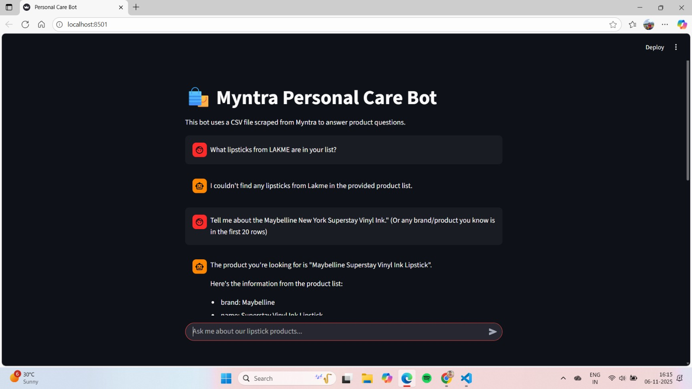
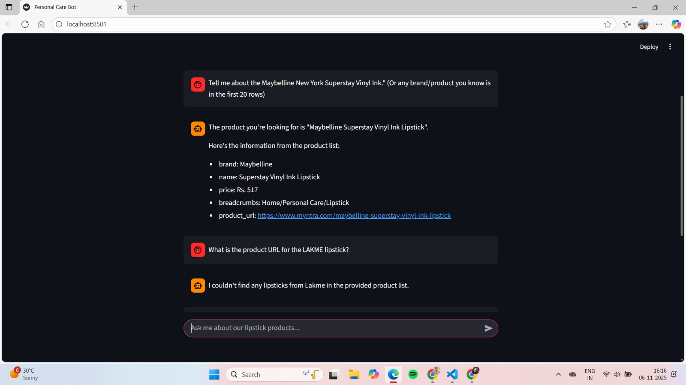
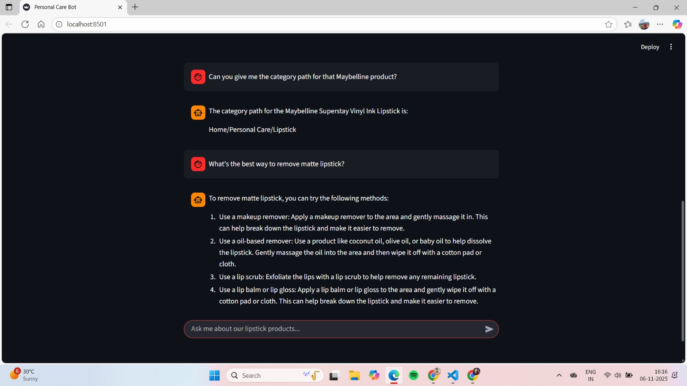

# Myntra Personal Care Chatbot 🛍️

This is a Proof-of-Concept (POC) chatbot built for a data science task. The bot is powered by a Large Language Model (Groq) and is designed to answer questions about personal care products using a scraped dataset from Myntra.

**Live Demo:** **[https://aman245002-chatbot-project-test-app-nwhfjq.streamlit.app/](https://aman245002-chatbot-project-test-app-nwhfjq.streamlit.app/)**

---

## 📸 Screenshots

Here’s a look at the chatbot in action:

**Answering product-specific questions:**


**Handling keyword-based redirection for support:**


**Answering general knowledge questions:**


---

## ✨ Core Features

* **Product Q&A:** Answers questions about product details (brand, price, etc.) by reading from the scraped `myntra_products.csv` file.
* **Keyword Redirection:** Identifies keywords like "return," "offer," or "complaint" and directs the user to a human representative with a contact number.
* **General Knowledge:** Uses the LLM to answer general grooming and personal care questions.
* **Conversation Logging:** Securely logs every user query and AI response to a PostgreSQL database (Neon) for analysis.
* **Data Scraping:** Includes a separate script (`scrape.py`) that uses Selenium to scrape product data from Myntra.

---

## 🛠️ Tech Stack

* **Frontend:** Streamlit
* **LLM:** Groq (using `llama-3.1-8b-instant`)
* **Database:** PostgreSQL (hosted on Neon)
* **Web Scraping:** Selenium & BeautifulSoup
* **Data Handling:** Pandas
* **Deployment:** Streamlit Community Cloud

---

## 🚀 How to Run Locally

### 1. Prerequisites

* Python 3.8+
* A free [Groq](https://console.groq.com/keys) API key.
* A free [Neon](https://neon.tech/) PostgreSQL database.

### 2. Setup

1.  **Clone the repository:**
    ```bash
    git clone [https://github.com/aman245002/Chatbot_Project_Test.git](https://github.com/aman245002/Chatbot_Project_Test.git)
    cd Chatbot_Project_Test
    ```

2.  **Create and activate a virtual environment:**
    ```bash
    python -m venv .venv
    source .venv/Scripts/activate  # On Windows
    ```

3.  **Install the required libraries:**
    ```bash
    pip install -r requirements.txt
    ```

4.  **Run the scraper (One-time step):**
    This scrapes the Myntra data and creates the `myntra_products.csv` file.
    ```bash
    python scrape.py
    ```

5.  **Set up your secrets:**
    * Create a folder: `.streamlit`
    * Inside that folder, create a file: `secrets.toml`
    * Add your keys to this file:
        ```toml
        GROQ_API_KEY = "your_groq_api_key_here"
        DB_URL = "your_neon_database_url_here"
        ```

6.  **Set up your database:**
    * Log in to your Neon database and use the SQL Editor to run this one-time query:
        ```sql
        CREATE TABLE chat_logs (
            id SERIAL PRIMARY KEY,
            timestamp TIMESTAMPTZ DEFAULT CURRENT_TIMESTAMP,
            role VARCHAR(10),
            content TEXT
        );
        ```

### 3. Launch the App

```bash
streamlit run app.py